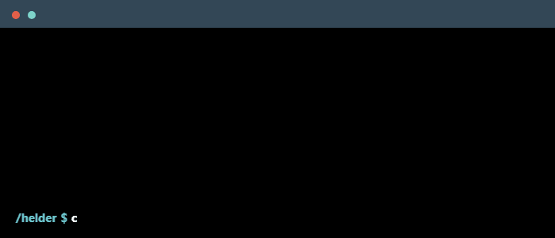

<!--
    Hey there, I'm Hélder Fernandes!
    Happy to see you exploring my README.
    Feel free to get inspired!

    If you like my work, a follow would mean a lot! 🚀
    Let's connect on LinkedIn: www.linkedin.com/in/helderfernandes101 :)
-->

<!--
    🎨 Header Banner
-->

    

<!--
    ✨ Animated Introduction - Readme Typing SVG
-->

    

### 🚀 My mission

- My name is Hélder Fernandes, i’m a passionate software developer focused on building clean, safe, scalable, and user-friendly web applications while continuously learning and improving my skills.

### 👀 About Me

- 📖 I’m currently learning **Flutter** and exploring **AWS** and **Azure**.
- 📌 I'm interested in **cybersecurity**, **mobile development**, **cloud technologies**.
- 💬 Ask me about: **C#, .NET, JavaScript, TypeScript, and Laravel**.
- 👨‍💻 My projects are available [here](https://github.com/HelderHub).
- 😄 Pronouns: **he, him**.
- ❤️ Favourite emoji: **🚀**.
- ⚡ Fun fact: I enjoy solving complex problems and optimizing processes, but I also love exploring new cuisines 🧑‍🍳.

### ⚙️ Main Skills

    
     
    
     
    

### 📚 Currently Learning

    

### 🌍 Connect with Me!

    
    
    

<!--

### 👨‍💼 Looking to Hire?

> [!IMPORTANT]  
> 📜 **[Download My Resume](https://drive.google.com/drive/folders/1hJGhQTtzDUzMqRtoIQUx7QTLtCN726ZK?usp=sharing)**

-->

<!-- ### ⚡️ GitHub Stats

    

 -->

### ☕ Support My Work

    

<!--
    🎨 Footer Banner
-->

    

<!--
    🔗 Resources Used in this README:

    - Typing SVG: https://github.com/DenverCoder1/readme-typing-svg
    - Skill Icons: https://github.com/tandpfun/skill-icons#readme
    - GitHub Stats: https://github.com/anuraghazra/github-readme-stats
-->

<!--  
    ❌ Unused Elements:

    

        
    

-->

<!--
    🎉 Thanks for stopping by! Feel free to connect. 🚀
-->
